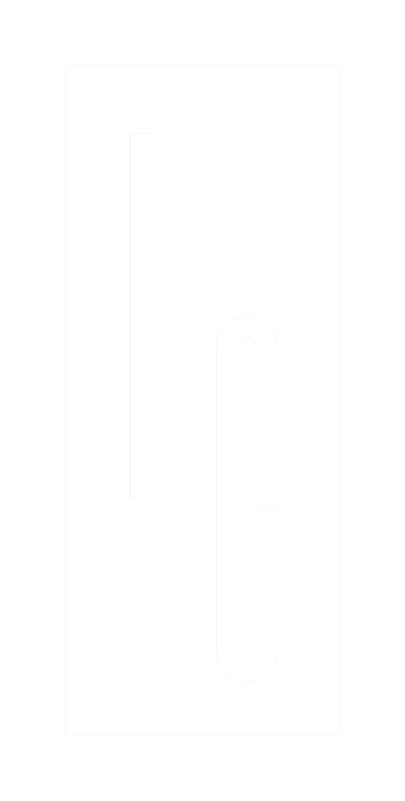
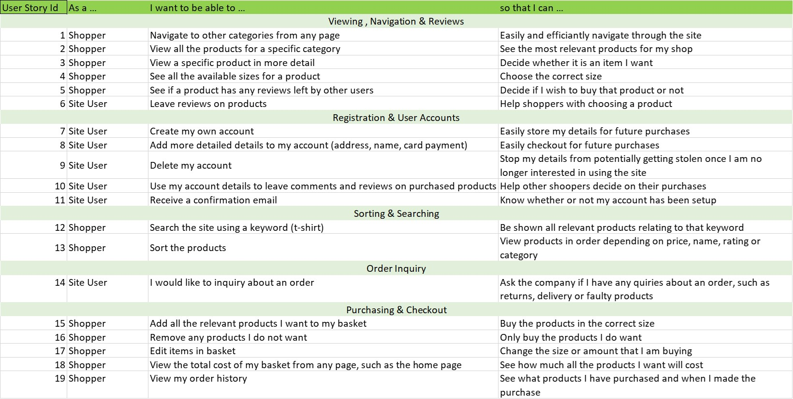
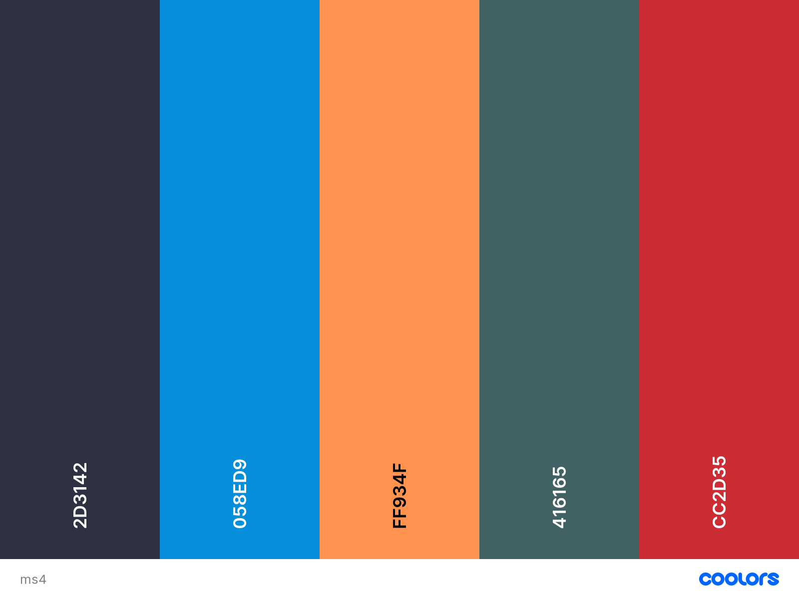

<!-- PROJECT LOGO -->
 

  

  <h2 align="center">Lawrence Collections README</h2>

  

     
    <a href="https://github.com/kylelawrencedev/lawrence-collections-ms4"><strong>Explore the docs »</strong></a>
     
     
    <a href="">View Demo</a>
  

<!-- TABLE OF CONTENTS -->

  
Table of Contents

  <ol>
    <li>
      <a href="#about-the-project">About The Project</a>
      <ul>
        <li><a href="#built-with">Built With</a></li>
      </ul>
    </li>
    <li>
      <a href="#getting-started-deployment">Getting Started:Deployment</a>
    </li>
    <li><a href="#usage">Usage</a></li>
    <li><a href="#defensive-design">Defensive Design</a></li>
    <li>
        <a href="#roadmap">Roadmap</a>
        <ul>
        <li><a href="#strategy-plane">Strategy Plane</a></li>
        <li><a href="#scope-plane">Scope Plane</a></li>
        <li><a href="#structure-plane">Structure Plane</a></li>
        <li><a href="#skeleton-plane">Skeleton Plane</a></li>
        <li><a href="#surface-plane">Surface Plane</a></li>
      </ul>
    </li>
    <li><a href="#wireframes">Wireframes</a></li>
    <li><a href="#database-structure">Database Structure</a></li>
    <li><a href="#contributing">Contributing</a></li>
    <li><a href="#license">License</a></li>
    <li><a href="#contact">Contact</a></li>
    <li><a href="#acknowledgements">Acknowledgements</a></li>
  </ol>

<!-- ABOUT THE PROJECT -->
## About The Project

[![][product-screenshot]](https://example.com)

I have been wanting to create a clothing store for ages. I was tempted to create one for my MS3 project, but was told that I would learn about creating a store for my MS4 project. So now I can finally have a crack at it. 

I enjoy browsing and user simple sites. Some sites can get complicated. This site is simple and clean. I has all the necessary features and it is accessible and userable for users of all age groups.

Goals:
* Have a clothing site that is user-friendly and is accesible for users with disabilities
* Users feel like they can trust the site, as there are plenty of sites out there that look unsafe as soon as the sites loads. 
* Want users to be able to implement their own DRY principles. Nothing worse than having to keep repeating yourself when shopping. 

### Built With

Frameworks used for site
* [Bootstrap](https://getbootstrap.com)
* [JQuery](https://jquery.com)
* [Django](https://www.djangoproject.com/)

-----
<!-- ROADMAP -->
## Roadmap
1. ### _Strategy Plane_

	**User Stories**
	
	  

2. ### _Scope Plane_

	**Features**
	
	 * Site will be responsive and user-friendly on all device sizes, from small mobile phones to large tablets and laptops
   * Site features will change in size and location depending on device size. Improving the user-experience
   * Users will know from the landing page what the purpose of the site is
   * Site users will have the option of creating an account, and all site users that already have an account will have the option to sign in to their account

3. ### _Structure Plane_

    **User Stories:**

    > - I want to be able to Navigate to other categories from any page, so that i can easily and effciantly navigate throught the site.
    > - I want to be able to view all products for a specific category, so that I can see the most relevant products for my shop.

    **Acceptance Criteria:**

    * All page have the same header with all the catgories headings and dropdowns available to click and navigate through.
    * All products are put into categories and categories are in the header of the site, the user can use the header to navigate to each specific category.

    **Implementation:**

    All pages will have the same header to keep up with continuity, making it easier for the user to navigate. Each product is put into specific categories when being added to the store. Each product is then put into its relevant category.

    **Result:** User Story accomplished.

    **User Stories:**

    > - I want to be able to view a specific product in more detail, so that I can decide whether it is the item I want
    > - I want to be able to see all the available sizes for a product, so that I can choose the correct size
    > - I want to be able to add an item to a wishlist, so that I can see all my favourite items from various categories in one place

    **Acceptance Criteria:**

    * User can view any product in more detail by clicking the product and going to its product details page
    * All products will have a size chooser on the products details page
    * On both the products details page and the products overview page will be a button that adds a product to the users wishlist

    **Implementation:**

    Users will be redirected to a new page to show the details for the product they clicked on. Where the products details are shown, there will be an option for the user to select a size, choose how many and also to add the product to their wishlist.

    **Result:** User Story accomplished.

    **User Stories:**

    > - I want to be able to create my own account, so that I can easily store my details for future purchases
    > - I want to be able to add more detailed details to my account (address, name, card payment), that that I can easily checkout for future purchases
    > - I want to be able to receive a confirmation email, so that I can know whether or not my account has been setup
    > - I want to be able to

    **Acceptance Criteria:**

    * User can access a registration form page and enter their details.
    * User receives an email confirming their sign up.
    * User can login of the site.
    * User can logout of the site.

    **Implementation:**

    Site users can navigate to the top righrt corner and click the icon. They will be redirected to the signup/register page. Once a user has signed in or registered, a new button will the appear at the top right. This will allow all signed in users to the logout of their account.

    **Result:** User Story accomplished.

    **User Stories:**

    > - I want to be able to delete my own account, so that I can stop my details from potentially getting stolen once I am no longer interested in using the site

    **Acceptance Criteria:**

    * User can click button and their account is deleted
    * If user tries to log back into their deleted account they will get an error message

    **Implementation:**

    In the accounts page, at the bottom will be a button for the user to click and delete their account. When they click the button they will be asked if they are sure they wish to delete their account. If they say yes, then their account will be deleted

    **Result:** User Story accomplished.

    **User Stories:**

      > - I want to be able to search the site using a keyword (t-shirt), so that I can be shown all relevant products related to that keyword
      > - I want to be able to sort the products, so that I can view products in order depending on pricer, name, rating or category

      **Acceptance Criteria:**

      * User can type any word into the search box and click search with a page loading of all relevant products. And if no products match the keyword the user will see a relevant message, such as "No products found"
      * User can use the dropdown option on the products page to select their relevant sorting option

      **Implementation:**

      All users can type in the search box and search the site for products. Any products matching the search will be shown in a similar way to the other product pages, users will still be able to sort their search results. On the right of the products page at the top will be the option for the user to sort the products from the relevant options

      **Result:** User Story accomplished.

4. ### _Skeleton Plane_

	**Navigation:** Browsing

	* Click on the profile icon to navigate to their account
	* There will be a back to top button to help users navigate to the top of the page with a single click

	**Navigation:** Searching

	* Users can use search through all the products by just typing in some keywords.

	**Features**

	*   Responsive on all device sizes.

	*   Interactive elements.

	**Existing Features** 

	* Sign Up to open an account
	* Login for users who already have an account
	* View and edit account details

	**Future Features**

	* Text-to-Speech API. This will help many users who may struggle with reading on an electronic devices or for visually impaired users. This feature will read out the products description, price, and rating
	* Text Enlarger. This will enlarge text for users who may struggle with reading on electronic devices and are unable to use the text-to-speech feature. Users who having hearing problems and having poor vision can benefit from this feature as the text will become much larger.
	* Change Backgrounds. This option will allow users with dyslexia to pick a background colour that is more suitable for them.
  * Discount Roulette Wheel. This feature will give users with an account the opportunity to spin a wheel and get a discount. Get user will only be able to spin the wheel once a day, or once per week.
  * Quick Buy. This feature will allow users to add items into their basket from the products overview page. They will not need to navigate to the products details page. This will make it easier and faster for shoppers to add products to their basket.

5. ### _Surface Plane_

	**Colour Palette**

	

	* For the colours we used [Inclusive Color Palettes for the Web](https://medium.com/cafe-pixo/inclusive-color-palettes-for-the-web-bbfe8cf2410e). This site gave us several colours and colour palettes to look at which are inclusive for all users. These colours are user friendly for visually impaired and do not ruin the experience for users that are not visually impaired

	**Font**

	* Google Fonts was used to import the fonts Antic Didone & Opens Sans into the base.css file. These fonts were used throughout the site.

  
## Wireframes
Wireframes can be found [HERE](./WIREFRAMES.md)

-----

## Testing
Testing can be found [HERE](.TESTING.md)

-----

## Database Structure
When making the structure of the databse, I had to think of how the data would interact with each other. I wanted it to be logical and easy to follow. Every product it linked to a category, every review is linked to a user account, and every order is linked to a user.

Every order has its own order number that gets created once the users purchase is successful. This order number is then linked to the users account. If a user is not registered the order number is linked to the email they provide at checkout.

During development I used SQLite, which is provided by Django. For production I used Heroku Postgres. For production mode I also used Amazon Web Services (AWS) to host all my static and media files.

You can see the data structure [here](DATABASE.md)

-----

<!-- GETTING STARTED -->
## Getting Started: Deployment

1. ## **Github**

    * When on GitHub navigate to [gym-records-crud](https://github.com/kylelawrencedev/gym-records-crud) repository. Once at the repository under the name will be 'Settings', which must be clicked.
    * When on the settings pages, start to scroll down.
    * While scrolling look out for the heading "Pages"
    * Under the heading click on the drop-down menu under source. 
    * In the dropdown menu select either 'None' or 'Branch' as your publishing source.
    * Once selected, you can select a folder for your publishing source. This can be either "/(root)" or "/docs".
    * Then click save.

    "If you choose the /docs folder on any branch as your publishing source, then later remove the /docs folder from that branch in your repository, your site won't build, and you'll get a page build error message for a missing /docs folder." 
    [Configuring a publishing source](https://docs.github.com/en/free-pro-team@latest/github/working-with-github-pages/configuring-a-publishing-source-for-your-github-pages-site)

2. ## **requirements.txt**

    * Create requirements.txt type, "pip3 freeze --local > requirements.txt"
    * Add file to staging area, "git add ."
    * Commit message type, "Add requirements.txt"
    * Push file to heroku, "git push -u heroku master"

3. ## **Heroku:**

    **Signing Up To Heroku:**

      * Navigate to [Heroku](https://heroku.com)
      * Once there click sign-up and create a new account
      * Select Python as your Primary Development Language
      * You will receive a confirmation email with a link to validate your account. If you do not receive the link within 15 minutes check your spam folder, or contact Heroku directly.
      * Enter a password

      * _Create a New Heroku App_

      * Click "Create New App", name your app something unique (Do not use any spaces, uses hyphens "-")
      * Choose the closest region from the list
      * Click "Create App"

    **Heroku Toolbelt**

      * In the terminal type, "npm install; -g heroku"
      * Log into heroku using the command "heroku login" in your terminal
      * Log in using your previously used details.
      * Enter the command, "heroku apps". This will show which apps you have
      * In the terminal enter, "--app (apps name)"

    **Pushing to Heroku**

      * Add all your files to the staging area by using, "git add -A" or "git add ."
      * Your commit messsage will be, "Deployment to Heroku"
      * Go back to the heroku site, and head to "settings" for the app. Copy the Heroku Git URL
      * In the terminal type, "git remote add", and for the name, "heroku". Then paste the URL.

6. ## **Procfile**

    * In terminal type, "echo web: python run.py > Procfile" (Has to be a capital P for Procfile)
    * git add Procfile
    * git commit -m "Add Procfile"
    * and git push
    * In settings find "Reveal Config Vars"
    * Add the key"IP" and value of "0.0.0.0"
    * Add the key "PORT" and the value of "5000"
    * Add the "SECRET_KEY", and the value of the key in your env.py file"
    * Click the deply tab, And connect to GitHub
    * Get your repository name, paste it into Heroku and click Search
    * Your repository should show up, click connect.
    * Go back to your terminal, type "git remote rm heroku"
    * git add .
    * git commit -m "Push to Github"
    * git push origin master
    * Go back to Heroku and click "Deploy Branch"

7. ## **Cloning my repository**

    * Go to  repository
    * Above where all the files are listed there will be a button that says "Code"
    * When clicked, a drop-down menu will appear. 
    * Click on "Open with GitHub Desktop"
    [Cloning a repository from GitHub to GitHub Desktop](https://docs.github.com/en/free-pro-team@latest/desktop/contributing-and-collaborating-using-github-desktop/cloning-a-repository-from-github-to-github-desktop)

-----

<!-- USAGE EXAMPLES -->
## Usage

## Defensive Design
### Brute-Forcing 

* If a user is not logged into the site and they paste the url for a link that only logged in users can access, they will be redirected back to the login page.
* Pages that cannot be accessed without being logged in are, overview, profile, add workout, edit workout, add record, edit record and search.
* Pages that can be accessed by anybody are, the home page and login/create account page.

-----

<!-- CONTRIBUTING -->
## Contributing

**greatly appreciated**.

1. Fork the Project
2. Create your Feature Branch (`git checkout -b feature/AmazingFeature`)
3. Commit your Changes (`git commit -m 'Add some AmazingFeature'`)
4. Push to the Branch (`git push origin feature/AmazingFeature`)
5. Open a Pull Request

-----

<!-- ACKNOWLEDGEMENTS -->
## Acknowledgements
* [Font Awesome](https://fontawesome.com)
* [Home Page Main Image](https://www.pexels.com/photo/woman-wearing-white-crew-neck-t-shirt-with-black-canon-dslr-on-her-shoulder-1549200/) 