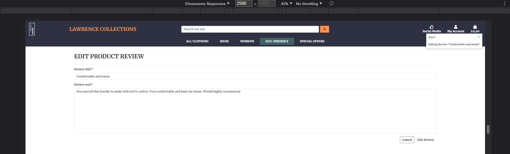
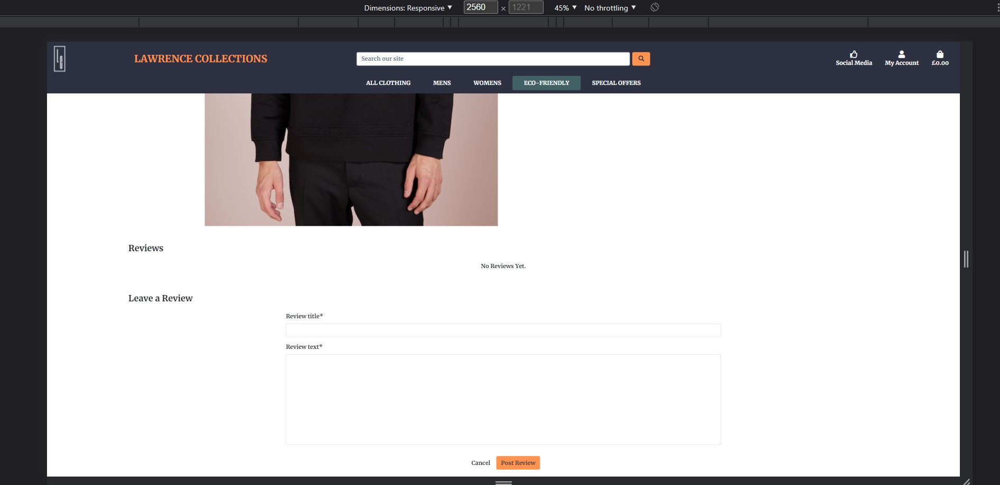
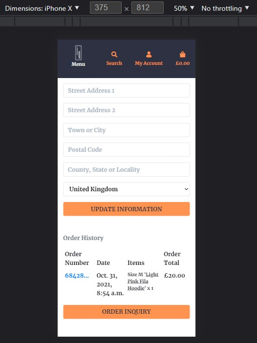

# Lawrence Collections
## Testing

## Home Page

* As a site user I want to be able to see what product categories the site sells as soon as the page loads
* As a site user I want to be able to either log into my account or to signup and create a new account within a few clicks

## Home Page Buttons

* Tested all buttons and made sure they all redirect the user to the correct page.
    * Company logo and name redirect user back to home page
    * Social Media links redirect to each relevant site
    * My Account dropdown buttons redirect to relevant pages
    * Shopping bag button redirects user to their shopping back
    * All carousel buttons redirect user to the relevant category
    * Shop Now button redirects user to all product ordered from most expensive to least 

## Home Page Responsiveness

-----

## Products Page

* As a site user I want to view all the products in their relevant category
* As a site user I want to be able to see which products are in the category and then navigate to that category
* As a site user I want to see the price of each product easily and also see any other relevant information about the products below the product

## Products Page Buttons

* Tested all buttons and links on products page to make sure the redirect the user to the correct page
    * Clicked on a product and was directed to the product details page
    * As a superuser I can edit products, clicked on the edit button and was redirected to the products edit page

## Products Page Responsiveness

* All Products shift into one column 

## Product Details Page

* As a site user I want to be able to view further details about the product, such as a product description and what sizes the product comes in
* As a site user I want to be able to see any reviews that have been left by other users
* As a registered site user I would like to be able to post my own reviews about products
* As s site user I want to be able to add items into my bag

## Product Details Buttons

* Tested all buttons on product details page, making sure they redirect the user to the correct pages
    * Added a product to my bag
    * Posted my own review
    * As a superuser I can edit products, clicked edit button and was redirected to edit product page
    * As a user who posted a review, I can now edit or delete my review. No other user can edit or delete my review

## Product Details Responsiveness

## Edit/Delete Product Page

* As a site superuser I want to be able to edit any of the products

* Editting product works the same as adding product
* Deleting a product removes product from site

* Bugs
    * When clicking cancel, the user is redirected back to viewing all the products. Ideally they would be redirected back to the product

-----

## Edit/Delete Review

* As a registered site user I want to be able to edit my own reviews, or even delete them

* Bugs
    * When submitting edited review, instead of being redirected back to the same product, the user is redirected to viewing all the products. Same goes for clicking cancel

-----

## Bag Page

* As a site user I would like to have the option of removing an item from my bag
* As a site user I want to be able to update the number of one specific item in my bag, increase it from 1 to 3
* As a site user I want to see how much everything I want to buy will cost

## Bag Page Buttons

* Tested all buttons on the bag page, making sure they redirect the users to the relevant pages
    * Changing order quantity from 1 to 3 and clicking update, reloads the page and shows the updated price and quantity
    * Clicking remove, removes the item from the bag
    * Clicking keep shopping takes me back to all the products
    * Clicking secure checkout takes me to the checkout page

* Bug found during testing
    * When adding different sizes of one item to them bag and then clicking remove on one of the sizes. All products are removed
    * When removing an item from bag, only the name of the item shows up in the messages. The product size should also show

## Bag Page Responsiveness

-----

## Checkout Page

* As a site user I want to be able to successfully purchase my products
* As a registered site user I want to have the checkout page details already prefilled will any of the information I have alreadt given, such as name or email address

## Checkout Page Buttons

* Tested all buttons on the checkout page
    * Clicking adjust bag takes me back to the shopping bag
    * Clicking secure payment if the form and card details are valid takes me to the checkout success page

## Checkout Page Responsiveness

-----

## Checkout Success Page

* As a site user once I have completed checkout successfully I would like to see a summary of what I have just bought

## Checkout Success Buttons
* Tested all buttons on checkout success page, making sure they redirect user to correct page
    * Clicking "Now check out our latest deals" button redirects user to new arrivals and clearance products

## Checkout Success Responsiveness

## My Account Page

* As a registered site user I would like to be able to update any of my information that I have for my account, such as name or address.
* As a registered site user who has made a purchase, I would like to be able to see all my orders in my account

* My details were removed for privacy reasons, but you can see the update information button works 

## My Account Buttons

* Tested all buttons on the my account page
    * Clicking to update information reloads the page and updates the form to the new information
    * Clicking the order number, redirects me to the checkout success page, showing me the order summary
    * Click the order inquiry button redirects me to the order inquiry page

## My Account Responsiveness

-----

## Product Management Page

* As a site superuser I want to be able to add products to the site
    * I want to have the ability to pick the products category, image, and whether or not it has sizes

## Product Management Buttons

* Tested all links and buttons on the product management page
    * Dropdown for "Has Sizes" shows option for yes or no
    * Clothing material dropdown shows the two options for the clothing material. This option can be left blank if the clothes are not made from the two options
    * Clicking Select Image, allows the user to select an image from their phone or computer. This will then be the products image
    * Clicking Add Product will add the product to the site, and the user will be taken to the products detail page
    * Clicking cancel takes the user to view all the products

## Product Management Responsiveness

-----

## Order Inquiry Page

* As a registered site user I want to be able to send the company a query about one of my orders

## Order Inquiry Buttons

* Tested all buttons on order inquiry page, making sure they work and redirect user to correct page
    * Clicking submit shows me a message saying my query has been successfully sent
    * Clicking submit with an invalid form, stops the query from being sent and I am shown an error message

## Order Inquiry Responsiveness

